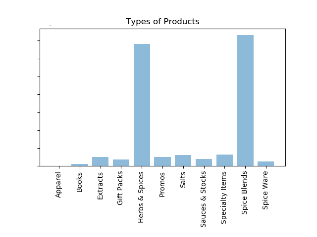
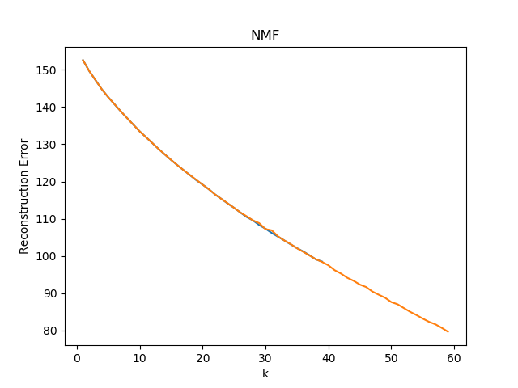
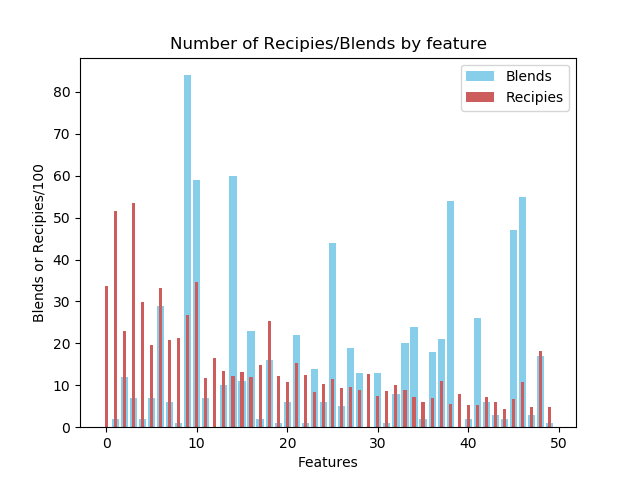

# Spice Sales
This project will analyze sales orders created for a retailer with several specialty spice stores. This store offers hundreds of spices, seasonings, and other specialty food products at over 20 locations nationwide and online through their website. This will involve looking at 6 years worth of Sales Order data, list of products, and a database of recipies.   The model will use several superviesed and unsupervised Machine Learning algorithms.   I also found a list of about 20,000 recipes and used a web scraper to get 7,000 more recipes.

## Product Analysis

This spice retailer sells a number of products but the main areas are direct herbs and spices and spice blends.  Spice blends are custom blend of spices that can be used 

## New Blend Analysis

