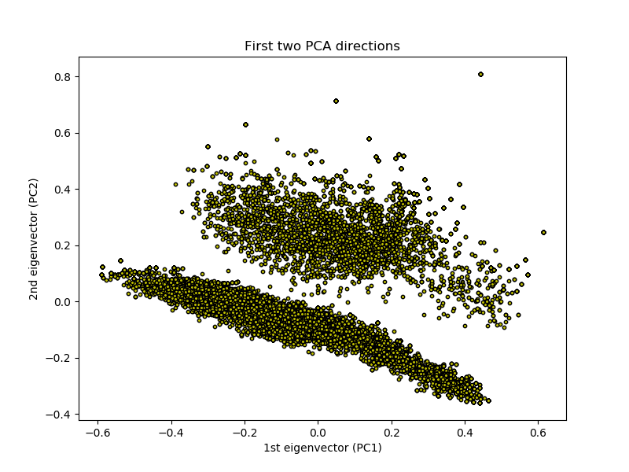

# Spice Sales
This project  analyzed the sales orders created for a retailer with several specialty spice stores. This store offers hundreds of spices, seasonings, and other specialty food products at over 20 locations nationwide and online through their website. This will involve looking at 6 years worth of Sales Order data, list of products, and a database of recipies.   The model will used Non-negative matrix factorization (NMF) for its model although PCA and others were considered.   

## Product Analysis

This spice retailer sells a number of products but the main areas are direct herbs and spices and spice blends.  Spice blends are custom blend of spices that can be used 

The two main pieces of data used for this project from above was the list if Herbs and Spices and the list of Blends.  From the companies website you could get a list of ingredients for each spice blend.   From this list of Spices and the ingredients of the blends a list of words we wanted to analize was created.   

Using the list of recipies like an example below, and the blends, and ingredients can be used to find blends that match to recipies, and potentially blends yet to be created.  

Steamed Black Cod with Soy-Chile Sauce
https://www.bonappetit.com/recipe/steamed-black-cod-with-soy-chile-sauce
[\'1 head of garlic, 3 cloves sliced, remaining head halved crosswise\', \'6 scallions, trimmed, 2 cut into 2" pieces, 4 thinly sliced\', \'1 5" piece peeled fresh ginger, cut into matchstick-size pieces\', \'1/2 lemon\', \'4 4-ounce black cod fillets, skin on\', \'1 tablespoon vegetable oil\', \'Kosher salt\', \'2 tablespoons reduced-sodium soy sauce\', \'2 green Thai chiles or 1 serrano chile, thinly sliced\', \'1 tablespoon chopped fresh cilantro\']

## Process
- Get a list of Herbs and spices that are sold
- Add to list any ingredients in blends (like parm
## Recipe Analysis
First I looked for order in the data by using PCA with two pricipal components.  

In the diagram above one recipe in the top part contained ['dried', 'green', 'celery', 'lemon', 'pepper'] one in the below shape contained ['fennel', 'bulb', 'anise', 'leaves', 'onion'].  Although this might have worked for this analysis, a spice with -.2 and -.4 in not very intuative to understand.   
### Spices

'achiote', 'acid', 'activated', 'adobo', 'aji', 'ajowan','alcohol', 'alderwood', 'aleppo', 'allspice', 'amarillo', 'ancho','anise', 'annatto', 'applewood', 'arbol', 'arrowroot', 'asabi','asafetida', 'asiago', 'basil', 'bay', 'bhut', 'bleu', 'bolete','bourbon', 'brokenbag', 'cacao', 'candied', 'caramel', 'caraway','cardamom', 'cascabel', 'cassia', 'cayenne', 'celery', 'ceylon','ceylontrue', 'chanterelle', 'charcoal', 'charnushka', 'cheddar','cheese', 'chervil', 'chia', 'chile', 'chiles', 'chili', 'chilies','chipotle', 'chives', 'chocolate', 'cilantro', 'cinnamon', 'citric', 'clove', 'cloves', 'coarse', 'cocoa', 'coffee', 'color', 'coriander', 'corn', 'coupe', 'cowês', 'crack', 'cream', 'crystalized', 'cubeb', 'culture', 'cultures', 'cumin', 'curry', "d'espelette", 'dill', 'dry', 'epazote', 'essential', 'fennel','fenugreek', 'frankincense', 'galangal', 'garlic', 'ghost','ginger', 'gmo', 'grains', 'granulated', 'granules', 'grass','green', 'grenada', 'grey', 'guajillo', 'gum', 'gumbo', 'habanero', 'habanerobag', 'harina', 'hibiscus', 'hickory', 'himalayan', 'honey', 'horseradish', 'jalapeno', 'japone', 'japones', 'jolokia', 'juice', 'juniper', 'lactic', 'lampong', 'lavender', 'lemon','lemongrass', 'lime', 'lovage', 'mace', 'madagascar', 'mahlab', 'makrut', 'malabar', 'maple', 'marjoram', 'masa', 'mayan', 'mecos', 'mesquite', 'meyer', 'morita', 'moritas', 'moroccan', 'mulato',  'mushroom', 'mushrooms', 'mustard', 'mustards', 'myrrh', 'mysore',  'naturally', 'negro', 'nibs', 'nutmeg', 'nutmegs', 'onion', 'onyx',  'orange', 'oregano', 'orris', 'pakistan', 'paprika', 'paradise'  'parmesan', 'parsley', 'pasilla', 'pepper', 'peppercorns', 'peppermint', 'peppers', 'pequin', 'petals', 'piment', 'pineapple',  'pods', 'pollen', 'poppy', 'porcini', 'powdered', 'pumpkin','raritan', 'red', 'refinery', 'rinds', 'roasted', 'romano', 'rose',  'rosebuds', 'rosemary', 'saffron', 'sage', 'saigon', 'salt',    'sarawak', 'savory', 'scallions', 'scorpion', 'seaweed', 'serrano'   'sesame', 'shallot', 'shallots', 'shitake', 'smoke', 'smoked',  'smokedbag', 'sourced', 'spearmint', 'sriracha', 'sugar', 'sumac',   'sweet', 'syrup', 'szechwan', 'tahitian', 'tarragon', 'tasmanian',    'tears', 'tellicherry', 'tellicherry:', 'threads', 'thyme' 'tipico', 'toasted', 'tomato', 'trinidad', 'true', 'turkish'     'turmeric', 'urfa', 'vanilla', 'verbena', 'vinegar', 'wasabi',  'weed', 'worcestershire'

So based in the previous recipe you would only get the following ingredients for this recipe.

['garlic', 'cloves', 'scallions', 'ginger', 'green', 'thai', 'chiles', 'serrano', 'chile']

### Using NMF
When using NMF it inforces positve values and this can be helpful to understand which ingredients will be used.  NMF decomposes the recipe list into two matrices, W and H, when multiplied together they approximately recreate our original V matrix. Below is a visulizaton of the H matrix with the latent topics (k) across the bottom and the ingredients on the y axis.  The W matrix would be similar but it would have the recipies relating to the latent topics.   

I went with 50 topics, there is not noticeable bend in the elbow plot seen below.    

Using these two matricies allows the data to be compaired and recomendation made for the company and customers.   

Break down every recipe and blend into a list of latent topics allows us to compare a recipe to all the blends.  For example the recipe based on the W matrix above recipe 23236 which is 'Mackerel with Crushed Potatoes and Oregano' would have a latent feature matrix of 

0.04, 0.05, 0.  , 0.  , 0.  , 0.  , 0.  , 0.  , 0.  , 0.07, 0.,.....

and one of the blends 'Mt. Olympus Greek Style Seasoning' recipe 26927

0.01, 0.03, 0.  , 0.  , 0.  , 0.  , 0.  , 0.  , 0.  , 0.03, 0.,  

This is a pretty close with a cosine simularity of 0.82 match base on the ingredients, so this blend could be recomended to anyone using this recipe.

But what if there isn't a good match 'Asian Noodles with Barbecued Duck Confit' there isn't a good blend match, although it does reccomend 'Nacho Cheese Dip' 

Interesting no blends contain scallions.  But 700+ recipies call for this ingredient, this could be a potential new spice blend since there isn't a good match.    

These are recipes like

Korean Marinated Beef 
Steamed Chicken with Black Mushrooms and Bok C...
Cold Noodle Salad with Ponzu Sauce 
Quick Sesame Chicken With Broccoli 
Kimchi-Style Sautéed Cabbage 

That contain ingredients like the following.
'sesame', 'scallions', 'white', 'green', 'lime', 'powder', 'cayenne', 'garlic', 'ginger'

Maybe there might be a 'Ramen Booster' spice blend that is needed.  

